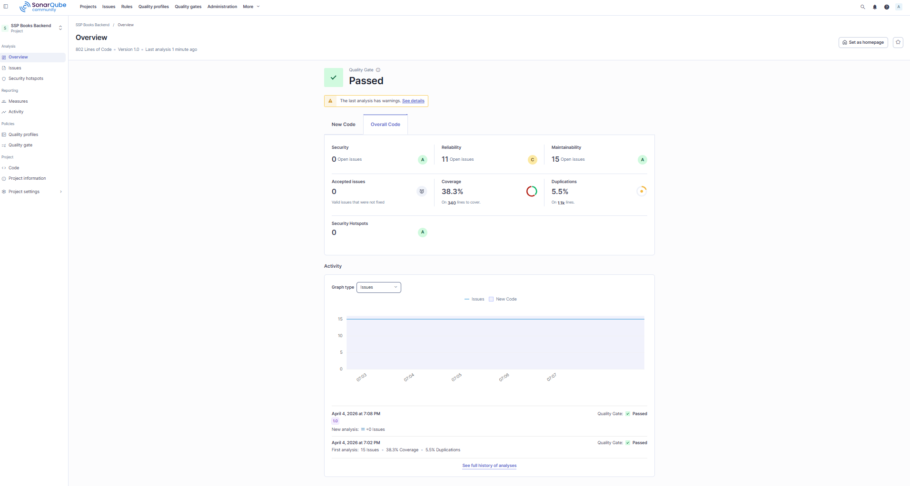
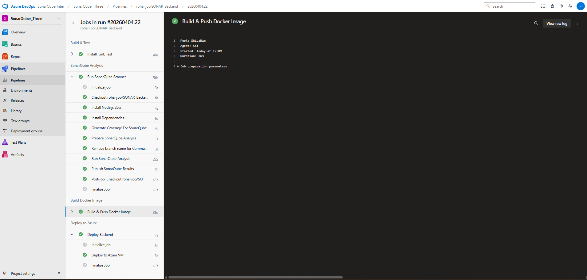
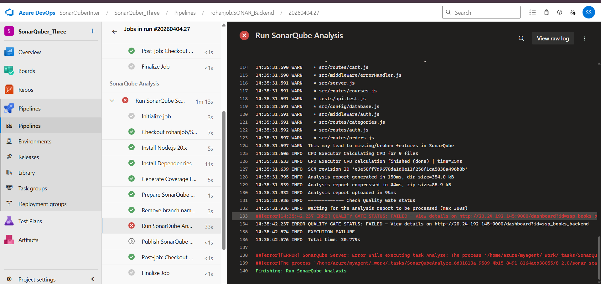
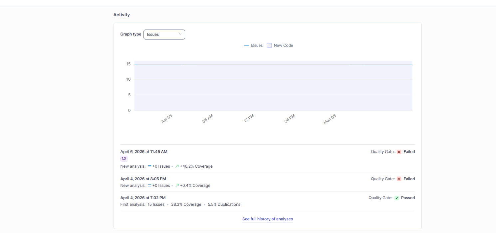
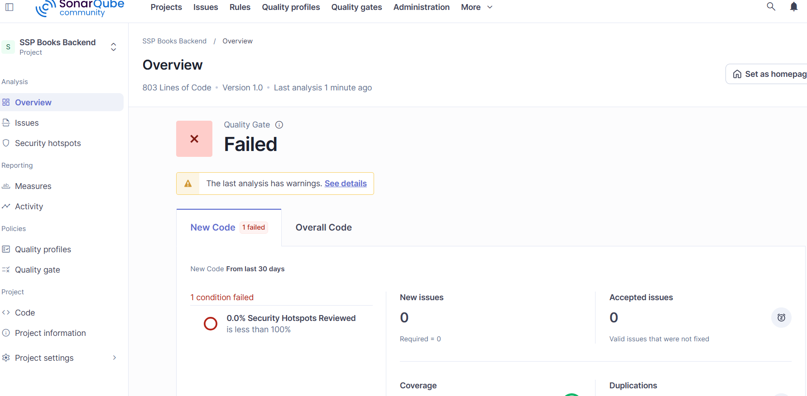

# 🚀 SSP Books - Backend API

Node.js/Express REST API for the SSP Books course buying platform with PostgreSQL.




##❌❌Errors or Failures :








## 📋 API Endpoints

| Method | Endpoint | Description | Auth |
|--------|----------|-------------|------|
| `GET` | `/api/health` | Health check | No |
| `POST` | `/api/auth/register` | Register user | No |
| `POST` | `/api/auth/login` | Login user | No |
| `GET` | `/api/auth/me` | Get profile | Yes |
| `GET` | `/api/courses` | List courses | No |
| `GET` | `/api/courses/featured` | Featured courses | No |
| `GET` | `/api/courses/bestsellers` | Bestsellers | No |
| `GET` | `/api/courses/:slug` | Course details | No |
| `GET` | `/api/categories` | List categories | No |
| `GET` | `/api/cart` | Get cart | Yes |
| `POST` | `/api/cart` | Add to cart | Yes |
| `DELETE` | `/api/cart/:courseId` | Remove from cart | Yes |
| `POST` | `/api/orders/checkout` | Checkout | Yes |
| `GET` | `/api/orders` | Order history | Yes |

## 🚀 Quick Start

```bash
npm install
npm run dev
```

## 🔧 Environment Variables

See `.env` file for all configuration options.

## 🔄 CI/CD

- **Azure Pipelines**: `azure-pipelines.yml`
- **SonarQube**: `sonar-project.properties`
